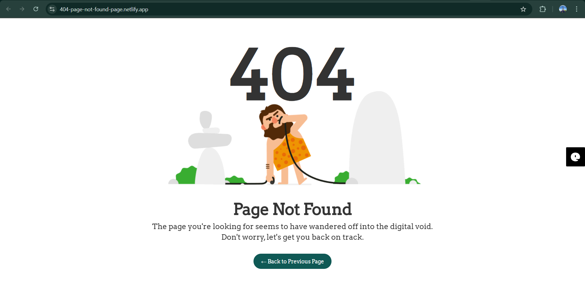

  

###

This is my first test website deployed on Netlify to learn web deployment and Github integration.

###

<h2 align="left">Project Description</h2>

###

- A simple HTML and CSS website - includes a custom 404 page layout - uses CSS for background image and styling

###

<h2 align="left">Screenshoott</h2>

###

<h2 align="left">Deployment</h2>

###

You can view live website here :

[Live Demo](https://404-page-not-found-page.netlify.app)

###

<h2 align="left">Folder Structure</h2>

###

| 
  |------- index.html 
  |---CSS/ 
  |   |-----style.css 
  | 
  |---Images/ |
      |-------bg.gif

###

<h2 align="left">Tech Stack</h2>

###

-  HTML -  CSS -  GitHub for version control -  Netlify for deployment

###

